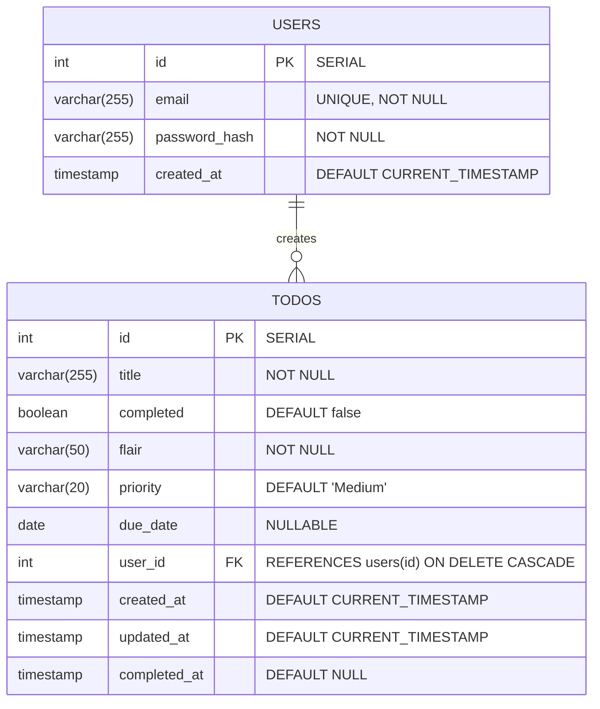

# 🐝 HiveMind - Enterprise Task Management

Welcome to **HiveMind**, a sleek, productivity-focused task management platform built to help you keep a track of pending work.

With stunning visuals, real-time UI interactivity, and a robust data layer, HiveMind is built to handle heavy workloads while remaining beautifully minimalistic.

## Features

- **Modern Authentication**: Secure JWT-based login and registration flows with a gorgeous unified split-screen design.
- **Dynamic Worker Bee Animations**: Real-time canvas particle effects (honeycomb explosions, floating swarm particles) that scale intelligently with the volume of your active tasks!
- **Task Categorization & Flairs**: Assign visual tags (`Coursework`, `Sport`, `Work`, etc.) to instantly organize your workload.
- **High-Priority & Overdue Systems**: High-priority tasks automatically rise to the top of your list. Overdue tasks are visibly marked with crimson alerts.
- **Smooth Audio-Visual Feedback**: Satisfying sound effects and particle bursts upon completing tasks.
- **Responsive Dark-Mode Architecture**: Beautiful gradients, glassmorphism, and custom UI components perfectly tuned for dark-mode.
- **Auto-Purge History**: Completed tasks are automatically and permanently removed 5 days after being marked done, keeping your workspace clean without manual intervention.

## Technology Stack

**Frontend:**
- React 18
- TypeScript
- Vite
- Custom CSS (No frameworks, pure bespoke styling)
- HTML5 Canvas Engine (for ambient background effects)

**Backend:**
- Node.js
- Express
- PostgreSQL (via `pg` driver)
- JSON Web Tokens (JWT) for secure auth
- Bcrypt for password hashing

## Database Architecture

The HiveMind data layer is built on PostgreSQL. It uses a basic, clean relational structure connecting `users` to their respective `todos`.

### Entity Relationship Diagram



### SQL Schema Definitions

The backend server automatically synchronizes these tables on startup.

**1. Users Table**
```sql
CREATE TABLE IF NOT EXISTS users (
    id SERIAL PRIMARY KEY,
    email VARCHAR(255) UNIQUE NOT NULL,
    password_hash VARCHAR(255) NOT NULL,
    created_at TIMESTAMP DEFAULT CURRENT_TIMESTAMP
);
```

**2. Todos Table**
```sql
CREATE TABLE IF NOT EXISTS todos (
    id SERIAL PRIMARY KEY,
    title VARCHAR(255) NOT NULL,
    completed BOOLEAN DEFAULT false,
    flair VARCHAR(50) NOT NULL,
    priority VARCHAR(20) DEFAULT 'Medium',
    due_date DATE,
    user_id INTEGER NOT NULL REFERENCES users(id) ON DELETE CASCADE,
    created_at TIMESTAMP DEFAULT CURRENT_TIMESTAMP,
    updated_at TIMESTAMP DEFAULT CURRENT_TIMESTAMP,
    completed_at TIMESTAMP DEFAULT NULL
);
```

### Auto-Purge Behavior

Completed tasks are automatically and permanently deleted **5 days** after being marked done. The backend runs a cleanup job every hour that removes any task where `completed_at` is older than 5 days. This keeps the history lean without any manual intervention. Tasks that are un-completed before the 5-day window resets their timer.

## Getting Started Locally

### Using Docker Compose (Recommended)

The easiest way to get HiveMind running is using Docker. This will automatically set up the Postgres database, build the backend, and start the frontend development server.

1. **Prerequisites**: Make sure you have [Docker](https://docs.docker.com/get-docker/) installed.
2. **Environment Variables**: Copy `.env.example` to a new file named `.env` in the root directory:
   ```bash
   cp .env.example .env
   ```
3. **Start the Stack**:
   ```bash
   docker compose up --build
   ```
4. **Access the App**: Open your browser and navigate to `http://localhost:5173`.

---

### Alternative: Manual Setup

If you prefer to run the components manually without Docker:

**Prerequisites:** [Node.js](https://nodejs.org/) and [PostgreSQL](https://www.postgresql.org/) installed and running.

#### 1. Database Setup
Create a local PostgreSQL database. The backend server will automatically synchronize and create the `users` and `todos` tables on startup if the database exists.

#### 2. Backend Setup
1. Open a terminal and navigate to the backend directory:
   ```bash
   cd backend
   ```
2. Install dependencies:
   ```bash
   npm install
   ```
3. Create a `.env` file inside the `backend` folder based on `.env.example` and fill in your local Postgres connection string and a secret key for JWT.
4. Start the backend server:
   ```bash
   npm run dev
   ```

#### 3. Frontend Setup
1. Open a new terminal and navigate to the frontend directory:
   ```bash
   cd frontend
   ```
2. Install dependencies:
   ```bash
   npm install
   ```
3. Start the development server:
   ```bash
   npm run dev
   ```
4. Open your browser and navigate to the `localhost` URL provided by Vite (usually `http://localhost:5173`).
